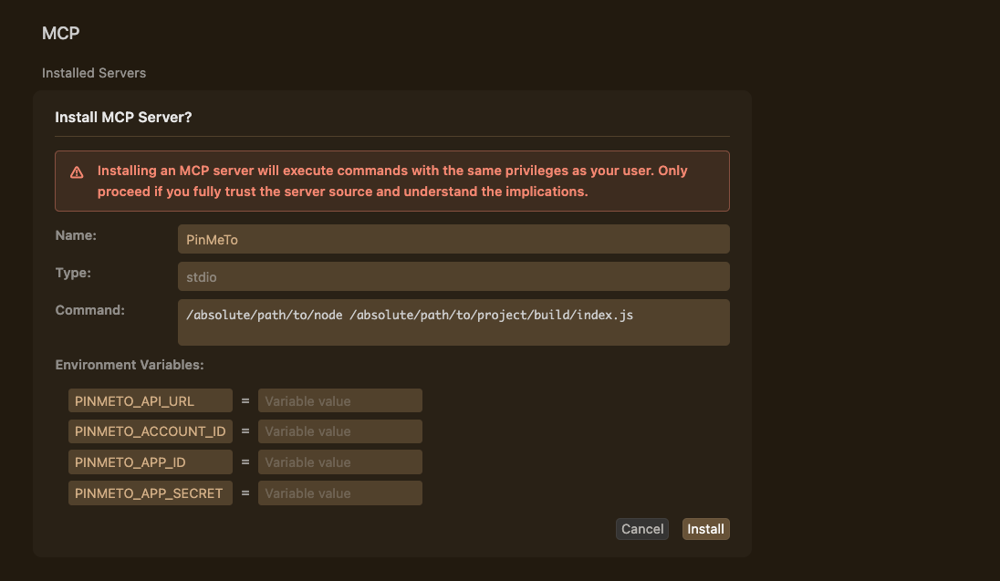

# PinMeTo Location MCP

The [PinMeTo](https://www.pinmeto.com/) MCP Server enables seamless integration between the [PinMeTo platform](https://places.pinmeto.com/) and AI agents such as Claude LLM, allowing users to interact with their location data and business insights through natural language. This server exposes a suite of tools that let you retrieve, analyze, and summarize data from PinMeTo, through multiple sources—including Google, Facebook, and Apple—covering metrics such as impressions, clicks, ratings, and more.

---

## Installation

The MCP Server can be built from this repository, or a single-click installer is available for Claude Desktop.

---

## Claude Desktop: One-Click Installation

The single-click installer binary for Claude Desktop is available in the "Releases" tab:

<https://github.com/PinMeTo/pinmeto-location-mcp/releases>

Below are instructions on how to generate the binary with `npx`:

### Prerequisites (Claude Desktop: One-Click Installation)

- **npm**
- **npx** (included with npm)
- **Claude Desktop**

### Steps (Claude Desktop: One-Click Installation)

1. **Clone the repository:**

    ```zsh
    git clone https://github.com/PinMeTo/pinmeto-location-mcp.git
    ```

2. **Open your project folder** in your text editor.

    ```zsh
    cd pinmeto-location-mcp
    ```

3. **Build** and **Run the MCPB installer:**

   ```bash
   npm install
   npm run build
   npx @anthropic-ai/mcpb pack
   ```

   - This generates a `.mcpb` file in your project directory.

4. **Install in Claude Desktop:**
   - With Claude Desktop open, double-click the `.mcpb` file.
   - Enter your PinMeTo API credentials when prompted ([PinMeTo Account Settings](https://places.pinmeto.com/account-settings/pinmeto/api/v3)).
     

- Enable the connector in Claude. You can now use the PinMeTo MCP integration.

---

## Claude Desktop: Manual Installation

Below are instructions on how to manually integrate the PinMeTo MCP with Claude Desktop:

### Prerequisites (Claude Desktop: Manual Installation)

- **Node.js v22+** (recommended: [NVM](https://github.com/nvm-sh/nvm))
- **npm** (included with Node.js)
- **Claude Desktop**

### Steps (Claude Desktop: Manual Installation)

1. **Clone the repository:**

    ```zsh
    git clone https://github.com/PinMeTo/pinmeto-location-mcp.git
    ```

2. **Open your project folder** in your text editor.

    ```zsh
    cd pinmeto-location-mcp
    ```

3. **Install dependencies and build the project:**

   ```bash
   npm install
   npm run build
   ```

4. **Configure Claude Desktop:**
    - Open your `claude_desktop_config.json` file. You can go to Preferences → Developer → Edit Config in the Claude Desktop Client. Or use on Mac:

    ```bash
    code ~/Library/Application\ Support/Claude/claude_desktop_config.json
    ```

    - Add the following MCP server configuration (with node)

        ```json
        {
        "mcpServers": {
            "PinMeTo": {
            "command": "/absolute/path/to/node",
            "args": ["/absolute/path/to/project/build/index.js"],
            "env": {
                "PINMETO_API_URL": "",
                "PINMETO_ACCOUNT_ID": "",
                "PINMETO_APP_ID": "",
                "PINMETO_APP_SECRET": ""
            }
            }
        }
        }
        ```

    - Add the following MCP server configuration (with npx)

        ```json
        {
        "mcpServers": {
            "PinMeTo": {
                "command": "npx",
                "args": ["-y", "PinMeTo/pinmeto-location-mcp"],
                "env": {
                    "PINMETO_ACCOUNT_ID": "",
                    "PINMETO_APP_ID": "",
                    "PINMETO_APP_SECRET": ""
                }
            }
        }

        }

        ```

    - Use absolute paths for both Node and your project:
    - Node path: `which node`
    - Project path: `pwd`

5. **Get your PinMeTo API credentials:**
   - Visit [PinMeTo Account Settings](https://places.pinmeto.com/account-settings/pinmeto/api/v3) and fill in the environment variables above.

6. **Restart Claude Desktop:**
   - Ensure all permissions are granted. You should now see "PinMeTo MCP" in your MCP selection.

<!-- ---

## Cursor: Direct Link Installation

Below are instructions on how to manually integrate the PinMeTo MCP with Cursor using a direct link:

### Prerequisites (Cursor: Direct Link Installation)

- **Node.js v22+** (recommended: [NVM](https://github.com/nvm-sh/nvm))
- **npm** (included with Node.js)

### Installation (Cursor: Direct Link Installation)

1. **Clone the repository:**

    ```zsh
    git clone https://github.com/PinMeTo/pinmeto-location-mcp.git
    ```

2. **Open your project folder** in your text editor.

    ```zsh
    cd pinmeto-location-mcp
    ```

3. **Install dependencies and build the project:**

   ```bash
   npm install
   npm run build
   ```

4. **Copy the link and paste it in your browser.**

    ```bash
    cursor://anysphere.cursor-deeplink/mcp/install?name=PinMeTo&config=eyJlbnYiOnsiUElOTUVUT19BUElfVVJMIjoiIiwiUElOTUVUT19BQ0NPVU5UX0lEIjoiIiwiUElOTUVUT19BUFBfSUQiOiIiLCJQSU5NRVRPX0FQUF9TRUNSRVQiOiIifSwiY29tbWFuZCI6Ii9hYnNvbHV0ZS9wYXRoL3RvL25vZGUgL2Fic29sdXRlL3BhdGgvdG8vcHJvamVjdC9idWlsZC9pbmRleC5qcyJ9
    ```

Enter your credentials.

- Use absolute paths for both Node and your project:
  - Node path: `which node`
  - Project path: `pwd`



---

## Cursor: Manual Installation

Below are instructions on how to manually integrate the PinMeTo MCP with Cursor manually:

### Prerequisites (Cursor: Manual Installation)

- **Node.js v22+** (recommended: [NVM](https://github.com/nvm-sh/nvm))
- **npm** (included with Node.js)

### Installation (Cursor: Manual Installation)

1. **Clone the repository:**

    ```zsh
    git clone https://github.com/PinMeTo/pinmeto-location-mcp.git
    ```

2. **Open your project folder** in your text editor.

    ```zsh
    cd pinmeto-location-mcp
    ```

3. **Install dependencies and build the project:**

   ```bash
   npm install
   npm run build
   ```

4. **To add this MCP server to Cursor**:

    1. Go to **Settings → Cursor Settings → MCP**.
    2. Click **+ Add New MCP Server**. This opens an `mcp.json` file.
    3. Add the same JSON configuration as shown in the Claude Desktop instructions.

        ```json
        {
        "mcpServers": {
            "PinMeTo": {
            "command": "/absolute/path/to/node",
            "args": ["/absolute/path/to/project/build/index.js"],
            "env": {
                "PINMETO_API_URL": "",
                "PINMETO_ACCOUNT_ID": "",
                "PINMETO_APP_ID": "",
                "PINMETO_APP_SECRET": ""
            }
            }
        }
        }
        ```

**Tip:**

- `~/.cursor/mcp.json` is your global MCP settings.
- `.cursor/mcp.json` is project-specific. For most cases, add the server to your project-specific file.

--- -->

## Available Tools

The PinMeTo MCP Server provides 15 comprehensive tools organized by category. All tools support both JSON (raw data) and Markdown (human-readable summaries) output formats.

> **⚠️ Important: Data Availability Lag**
>
> Insights data from different platforms have varying delay periods:
> - **Google insights:** ~10 days lag - request dates at least 10 days in the past
> - **Facebook insights:** ~3 days lag - request dates at least 3 days in the past
> - **Apple insights:** ~4 days lag - request dates at least 4 days in the past

### Location Management (2 tools)

#### `get_location`
Retrieve comprehensive details for a specific location by storeId.

**Returns:**
- Store identification and contact information
- Address and geographic coordinates
- Operating hours (regular, special, holiday)
- Network integration status (Google, Facebook, Apple)
- Categories, attributes, and service items

**Parameters:**
- `storeId` (required) - The PinMeTo store ID
- `format` (optional) - Response format: `json` (default) or `markdown`

**Use case:** Get detailed information about a single location before fetching network-specific insights.

---

#### `get_locations`
Retrieve a list of all locations in your PinMeTo account with optional field filtering and pagination control.

**Returns:**
- Paginated list of all locations with customizable fields
- Location names, storeIds, and status
- Contact information, addresses, and network integrations

**Parameters:**
- `fields` (optional) - Array of field names to include in response. Omit for all fields.
  - Example: `["storeId", "name", "isActive"]` for basic info
  - Example: `["storeId", "name", "contact", "address"]` for contact details
- `maxPages` (optional) - Maximum number of pages to fetch (1-10). Each page contains up to 1000 locations.

**Use case:** Find storeIds for use in other tools. This is typically the first tool to use in any workflow.

---

### Google Business Profile (6 tools)

#### `get_google_location_insights`
Fetch Google Business Profile performance metrics for a specific location over a date range.

**Returns:**
- Impressions (Search, Maps, total)
- Actions (calls, website visits, direction requests, bookings)
- Photo views and counts

**Parameters:**
- `storeId` (required) - The PinMeTo store ID
- `from` (required) - Start date in YYYY-MM-DD format (e.g., "2024-01-01")
- `to` (required) - End date in YYYY-MM-DD format (e.g., "2024-01-31")
- `format` (optional) - Response format: `json` or `markdown`

**Use case:** Analyze how a specific location performs on Google Search and Maps over time.

---

#### `get_all_google_insights`
Get Google insights for all locations in your account.

**Parameters:** Same as `get_google_location_insights` (except storeId)
**Use case:** Compare Google performance across all locations.

---

#### `get_google_location_ratings`
Get Google ratings and reviews for a specific location.

**Parameters:**
- `storeId` (required)
- `from` (required) - YYYY-MM-DD format
- `to` (required) - YYYY-MM-DD format
- `format` (optional) - `json` or `markdown`

**Use case:** Monitor customer feedback and rating trends for a location.

---

#### `get_all_google_ratings`
Get Google ratings for all locations in your account.

**Parameters:** Same as `get_google_location_ratings` (except storeId)
**Use case:** Identify locations with rating issues across your entire network.

---

#### `get_google_keywords`
Get Google search keywords for all locations.

**Returns:** Search terms that customers used to find your locations on Google.

**Parameters:**
- `from` (required) - Start month in YYYY-MM format (e.g., "2024-01")
- `to` (required) - End month in YYYY-MM format (e.g., "2024-12")
- `format` (optional) - `json` or `markdown`

**Note:** Uses month format (YYYY-MM) instead of full dates.

**Use case:** Understand what search terms drive traffic to your locations.

---

#### `get_google_keywords_for_location`
Get Google search keywords for a specific location.

**Parameters:** Same as `get_google_keywords` plus `storeId`
**Use case:** Analyze search term performance for a single location.

---

### Facebook Pages (5 tools)

#### `get_facebook_location_insights`
Fetch Facebook Page performance metrics for a specific location.

**Returns:**
- Page views and impressions
- Post engagement and reach
- Audience demographics

**Parameters:**
- `storeId` (required)
- `from` (required) - YYYY-MM-DD format
- `to` (required) - YYYY-MM-DD format
- `format` (optional) - `json` or `markdown`

**Use case:** Track Facebook page performance for a specific location.

---

#### `get_all_facebook_insights`
Get Facebook insights for all location pages in your account.

**Parameters:** Same as `get_facebook_location_insights` (except storeId)
**Use case:** Compare Facebook performance across all location pages.

---

#### `get_all_facebook_brandpage_insights`
Get Facebook insights for all brand pages in your account.

**Parameters:** Same as `get_facebook_location_insights` (except storeId)
**Use case:** Analyze brand page performance separate from location pages.

---

#### `get_facebook_location_ratings`
Get Facebook ratings and reviews for a specific location.

**Parameters:**
- `storeId` (required)
- `from` (required) - YYYY-MM-DD format
- `to` (required) - YYYY-MM-DD format
- `format` (optional) - `json` or `markdown`

**Use case:** Monitor customer reviews and ratings on Facebook.

---

#### `get_all_facebook_ratings`
Get Facebook ratings for all locations in your account.

**Parameters:** Same as `get_facebook_location_ratings` (except storeId)
**Use case:** Track Facebook rating trends across all locations.

---

### Apple Maps (2 tools)

#### `get_apple_location_insights`
Fetch Apple Maps performance metrics for a specific location.

**Returns:**
- Map views and impressions
- Direction requests
- Customer actions

**Parameters:**
- `storeId` (required)
- `from` (required) - YYYY-MM-DD format
- `to` (required) - YYYY-MM-DD format
- `format` (optional) - `json` or `markdown`

**Use case:** Track how customers discover and interact with your location on Apple Maps.

---

#### `get_all_apple_insights`
Get Apple Maps insights for all locations in your account.

**Parameters:** Same as `get_apple_location_insights` (except storeId)
**Use case:** Compare Apple Maps performance across all locations.

---

## Example Workflows

### Basic Workflow: Analyze a Single Location
```
1. Get all locations: "Show me all my locations"
   → Uses get_locations to find storeIds

2. Get location details: "Show me details for storeId ABC123 in markdown"
   → Uses get_location with format: "markdown"

3. Get Google insights: "Get Google insights for ABC123 from 2024-01-01 to 2024-01-31 in markdown"
   → Uses get_google_location_insights

4. Compare platforms: "Get Facebook and Apple insights for the same location and dates"
   → Uses get_facebook_location_insights and get_apple_location_insights
```

### Cross-Location Analysis
```
1. Get all locations: "List all my active locations"
   → Uses get_locations with fields: ["storeId", "name", "isActive"]

2. Compare Google performance: "Get Google insights for all locations for last month"
   → Uses get_all_google_insights

3. Find rating issues: "Show me all Facebook ratings for last month"
   → Uses get_all_facebook_ratings to identify locations needing attention
```

### Keyword Research
```
1. Get Google keywords: "What search terms brought customers to my locations in January 2024?"
   → Uses get_google_keywords with from: "2024-01", to: "2024-01"

2. Analyze specific location: "Show me keywords for storeId ABC123"
   → Uses get_google_keywords_for_location
```

---

## Features

### Response Formats
All tools support two output formats:
- **JSON** (default): Raw API data for programmatic processing
- **Markdown**: Human-readable formatted summaries for quick insights

Example: `format: "markdown"` parameter returns formatted tables and summaries.

### Input Validation
- Date parameters use regex validation (YYYY-MM-DD or YYYY-MM)
- Clear error messages with format examples when validation fails
- Helpful troubleshooting steps for common issues

### Pagination Control
- `get_locations` supports `maxPages` parameter (1-10 pages)
- Each page contains up to 1000 locations
- Useful for large accounts to limit response size

### Response Truncation
- Automatic 100k character limit (~25k tokens) prevents context overflow
- Truncated responses include helpful message suggesting filters
- Ensures reliable performance with large datasets

---
