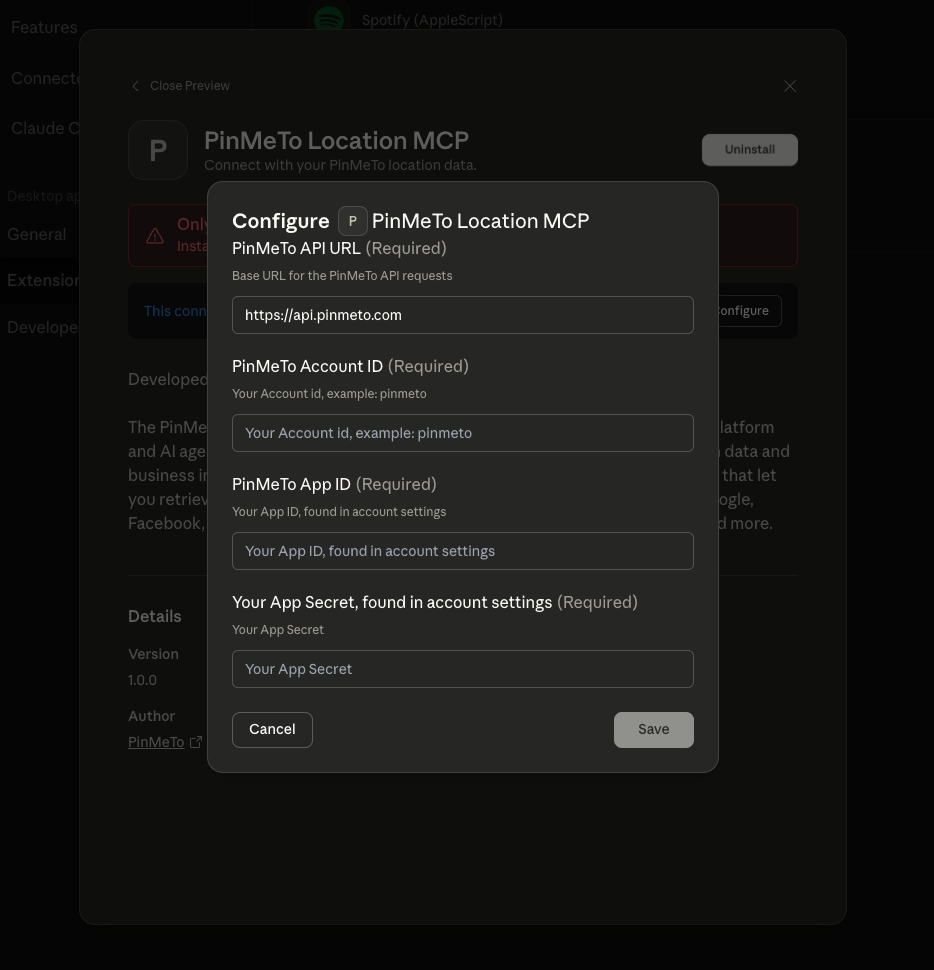

# PinMeTo Location MCP

The PinMeTo MCP Server enables seamless integration between the PinMeTo platform and AI agents such as Claude LLM, allowing users to interact with their location data and business insights through natural language. This server exposes a suite of tools that let you retrieve, analyze, and summarize data from multiple sources—including Google, Facebook, and Apple—covering metrics such as impressions, clicks, ratings, and more.

---

### Direct Installation for Cursor

- Copy the link and paste it in your browser.

```bash
cursor://anysphere.cursor-deeplink/mcp/install?name=PinMeTo&config=eyJlbnYiOnsiUElOTUVUT19BUElfVVJMIjoiIiwiUElOTUVUT19BQ0NPVU5UX0lEIjoiIiwiUElOTUVUT19BUFBfSUQiOiIiLCJQSU5NRVRPX0FQUF9TRUNSRVQiOiIifSwiY29tbWFuZCI6Ii9hYnNvbHV0ZS9wYXRoL3RvL25vZGUgL2Fic29sdXRlL3BhdGgvdG8vcHJvamVjdC9idWlsZC9pbmRleC5qcyJ9
```

Enter your credentials and use the absolute path to the project in the setup.


## Manual Installation (Claude Desktop)

### Prerequisites

- **Node.js v22+** (recommended: [NVM](https://github.com/nvm-sh/nvm))
- **npm** (included with Node.js)
- **Claude Desktop**

### Steps

1. **Install dependencies and build the project:**

   ```bash
   npm install
   npm run build
   ```

2. **Configure Claude Desktop:**
   - Open your `claude_desktop_config.json` file. You can go to Preferences → Developer → Edit Config in the Claude Desktop Client. Or use:

     ```bash
     code ~/Library/Application\ Support/Claude/claude_desktop_config.json
     ```

   - Add the following MCP server configuration:
     ```json
     {
       "mcpServers": {
         "PinMeTo": {
           "command": "/absolute/path/to/node",
           "args": ["/absolute/path/to/project/build/index.js"],
           "env": {
             "PINMETO_API_URL": "",
             "PINMETO_ACCOUNT_ID": "",
             "PINMETO_APP_ID": "",
             "PINMETO_APP_SECRET": ""
           }
         }
       }
     }
     ```
   - Use absolute paths for both Node and your project:
     - Node path: `which node`
     - Project path: `pwd`

3. **Get your PinMeTo API credentials:**
   - Visit [PinMeTo Account Settings](https://places.pinmeto.com/account-settings/pinmeto/api/v3) and fill in the environment variables above.

4. **Restart Claude Desktop:**
   - Ensure all permissions are granted. You should now see "PinMeTo MCP" in your MCP selection.

---

## One-Click Installation (Generating .mcpb-file)

### Prerequisites

- **npx** (included with npm)

### Steps

1. **Open your project folder** in your text editor.
2. **Run the MCPB installer:**

   ```bash
   npx @anthropic-ai/mcpb pack
   ```

   - This generates a `.mcpb` file in your project directory.

3. **Install in Claude Desktop:**
   - With Claude Desktop open, double-click the `.mcpb` file in Finder.
   - Enter your PinMeTo API credentials when prompted ([PinMeTo Account Settings](https://places.pinmeto.com/account-settings/pinmeto/api/v3)).
     

- Enable the connector in Claude. You can now use the PinMeTo MCP integration.

---

## Adding MCP to Cursor

### Adding it to Cursor manually

To add this MCP server to Cursor:

1. Go to **Settings → Cursor Settings → MCP**.
2. Click **+ Add New MCP Server**. This opens an `mcp.json` file.
3. Add the same JSON configuration as shown in the Claude Desktop instructions.

**Tip:**

- `~/.cursor/mcp.json` is your global MCP settings.
- `.cursor/mcp.json` is project-specific. For most cases, add the server to your project-specific file.

---

## Available Tools

- `Get Location` - Get pinmeto data on single location.
- `Get Locations` - Get all location data for site.
- `All Google Insights` - Get all Google insights for site locations.
- `Google Location Insights` - Get Google location insights for specific location.
- `Google Location Ratings` - Get Google location ratings for specific location.
- `All Facebook Insights` - Get all Facebook location insights for specific location.
- `Facebook Location Insights` - Get Facebook location insights for specific location.
- `Facebook Brandpage Insights` - Get Facebook insights for specific brandpage.
- `Facebook Location Ratings` Get Facebook location ratings for specific location.
- `All Apple Insights` Get all Apple location insights for site locations.
- `Apple Location Insights` Get Apple location insights for specific location.
