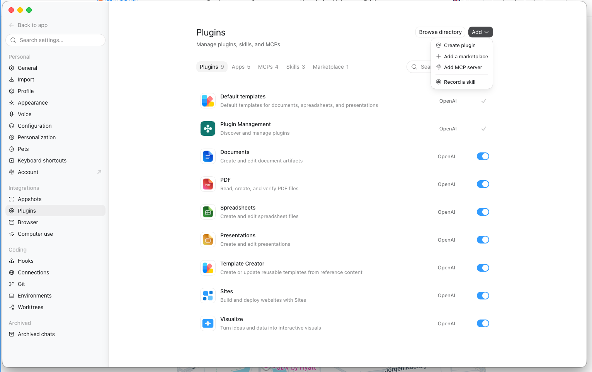

# PinMeTo Location MCP

   

An [MCP server](https://modelcontextprotocol.io/) that connects your [PinMeTo](https://www.pinmeto.com/) locations to AI assistants. Ask questions about your business in natural language and get instant insights from Google, Facebook, and Apple.

Works with MCP-compatible clients that can run local STDIO servers, including Claude Desktop, the ChatGPT desktop app, VS Code, Cursor, and more.

---

## What Can You Do With It?

Ask your AI assistant questions like:

- "What's my average Google rating across all locations?"
- "Show me negative reviews that need responses"
- "Compare this quarter's performance to last year"
- "Which locations are performing best?"

See [Example Prompts](docs/USE-CASES.md) for more ideas.

> 📊 **Turn your data into reports.** On top of the `.mcpb` data connection, install the [PinMeTo Locations plugin](https://github.com/PinMeTo/claude-plugins) to add formatted PDF and PowerPoint reports across all your locations. See [Creating Reports](#creating-reports) below.

---

## Installation

### Claude Desktop

1. **Download the installer:** click the `.mcpb` badge above, or grab [pinmeto-location-mcp.mcpb](https://github.com/PinMeTo/pinmeto-location-mcp/releases/download/v4.1.1/pinmeto-location-mcp.mcpb) from the latest release

2. **Double-click** the downloaded file (with Claude Desktop open), or drag it into Claude Desktop → Settings → Extensions

3. **Enter your PinMeTo API credentials** (Account ID, App ID, App Secret) in the install dialog

   

4. **Done!** This installs the data connection — the MCP server and its twelve tools. Start asking questions about your locations.

Get your credentials from [PinMeTo Account Settings](https://places.pinmeto.com/account-settings/pinmeto/api/v3).

**Reports (optional).** To also generate PDF and PowerPoint reports:

1. Open **Customize** in the sidebar, go to **Plugins**
2. Click **+** in Personal plugins, choose **Add marketplace**
3. Enter `PinMeTo/claude-plugins`
4. Install **PinMeTo Locations** — this adds the report skill

> **Note:** While the plugin repository is private, installing requires the Claude GitHub App to have access to it.

### ChatGPT Desktop App

The ChatGPT desktop app can run PinMeTo locally as a STDIO MCP server. You need
[Node.js v22 or later](https://nodejs.org/), [Git](https://git-scm.com/), and
PinMeTo API credentials before you start.

1. Get your Account ID, App ID, and App Secret from
   [PinMeTo Account Settings](https://places.pinmeto.com/account-settings/pinmeto/api/v3).
2. In the ChatGPT desktop app, open **Settings → Plugins**, then select the
   **MCPs** tab.
3. Select **Add → Add MCP server**.

   

4. Enter the following values:

   | Field | Value |
   |-------|-------|
   | Name | `PinMeTo` |
   | Type | **STDIO** |
   | Command to launch | `npx` |
   | Argument 1 | `-y` |
   | Argument 2 | `github:PinMeTo/pinmeto-location-mcp` |
   | Environment variable | `PINMETO_ACCOUNT_ID` = your Account ID |
   | Environment variable | `PINMETO_APP_ID` = your App ID |
   | Environment variable | `PINMETO_APP_SECRET` = your App Secret |

   Add each argument and environment variable in its own row. Leave
   **Environment variable passthrough** and **Working directory** empty.
5. Select **Save**, then restart when prompted.
6. Start a new Codex task in the desktop app. Enter `/mcp` to confirm that
   `PinMeTo` is connected, then try: “List my PinMeTo locations.”

If the server cannot find `npx`, locate it with `command -v npx` on macOS/Linux,
`(Get-Command npx).Source` in Windows PowerShell, or `where npx` in Windows
Command Prompt. Use the returned absolute path as **Command to launch**.

> **ChatGPT web:** This local STDIO setup is available to Codex in the ChatGPT
> desktop app. ChatGPT on the web does not read local MCP configuration; web
> Chat and Work use remote MCP tools supplied by plugins instead. See OpenAI's
> [MCP documentation](https://learn.chatgpt.com/docs/extend/mcp).

### Other Installation Options

| Platform | Method |
|----------|--------|
| VS Code | Click the VS Code badge above |
| Cursor | Click the Cursor badge above |
| Claude Code (CLI) | The plugin doesn't bundle a server. Run the server directly from GitHub: `npx -y github:PinMeTo/pinmeto-location-mcp` with the three `PINMETO_*` env vars, or use `claude mcp add` |
| Manual | See [Manual Installation](docs/MANUAL-INSTALLATION.md) |

---

## Available Features

| Feature | What You Can Do |
|---------|-----------------|
| **Locations** | View all your locations, search by name or city |
| **Google Insights** | Views, searches, direction requests, calls, clicks |
| **Google Reviews** | Read reviews, filter by rating, find unresponded reviews |
| **Google Ratings** | Average rating, review count, star distribution |
| **Google Keywords** | See how customers search for your business |
| **Facebook Insights** | Page engagement and reach metrics |
| **Facebook Ratings** | Ratings and recommendations |
| **Apple Insights** | Apple Maps performance metrics |

All insights support time aggregation (daily, monthly, quarterly) and period comparison (month-over-month, year-over-year).

---

## Creating Reports

Generate professional reports from your location data using the [PinMeTo Location Reports Skill](https://github.com/PinMeTo/pinmeto-location-reports-skill).

### What It Does

Transforms your multi-location analytics into formatted PDF and PowerPoint reports:
- **Monthly, Quarterly, Half-Yearly, and Yearly reports**
- Includes Google, Facebook, and Apple metrics
- Review ratings and sentiment analysis
- Search keyword performance
- Data-driven strategic recommendations

The report skill comes from the [PinMeTo Locations plugin](#claude-desktop);
the location data and tools come from the `.mcpb`. With both installed, ask for "a
quarterly report" or "a Q4 board presentation" and the skill activates automatically.

Prefer not to install the plugin? The skill is also available standalone from the
[skill repository](https://github.com/PinMeTo/pinmeto-location-reports-skill).

---

## Documentation

| Guide | Description |
|-------|-------------|
| [Getting Started](docs/GETTING-STARTED.md) | First steps, FAQ, and troubleshooting |
| [Example Prompts](docs/USE-CASES.md) | Prompts organized by business need |
| [Tools Reference](docs/TOOLS-REFERENCE.md) | Complete tool documentation |
| [Advanced Features](docs/ADVANCED-FEATURES.md) | Time aggregation and comparisons |
| [Manual Installation](docs/MANUAL-INSTALLATION.md) | Developer setup instructions |

---

## Requirements

- An MCP-compatible client ([Claude Desktop](https://claude.ai/download), [VS Code](https://code.visualstudio.com/), [Cursor](https://cursor.com/), or others)
- For local installation in the ChatGPT desktop app: Node.js v22 or later
- [PinMeTo](https://www.pinmeto.com/) account with API access

---

## Support

- **Setup issues**: See [Troubleshooting](docs/GETTING-STARTED.md#troubleshooting)
- **Feature questions**: See [FAQ](docs/GETTING-STARTED.md#faq)
- **Bug reports**: [GitHub Issues](https://github.com/PinMeTo/pinmeto-location-mcp/issues)
- **PinMeTo account**: [PinMeTo Support](https://www.pinmeto.com/contact)

---

## Privacy Policy

This server sends your PinMeTo API credentials to PinMeTo's API to fetch your own
location data, and returns that data to your MCP client. It stores nothing
remotely and transmits nothing to any third party.

- **Collected:** your PinMeTo Account ID, App ID, and App Secret, supplied by you at install time.
- **Used for:** authenticating requests to the PinMeTo API on your behalf.
- **Stored:** credentials remain under your MCP client's control (for example, the macOS Keychain under Claude Desktop); this server never writes them to disk. Location and insights data is cached in memory for the duration of a session and never written to disk.
- **Shared:** nothing is shared with third parties.
- **Retained:** the server itself retains nothing after the process exits, and its in-memory location and insights cache is discarded then. Credential persistence is managed by your MCP client, not by this server.
- **Contact:** [PinMeTo Support](https://www.pinmeto.com/contact)

Full policy: https://places.pinmeto.com/listings/public/legal/privacypolicy

---

## License

MIT
